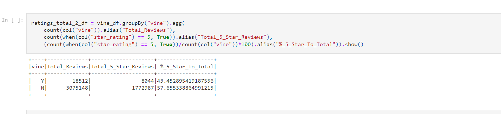
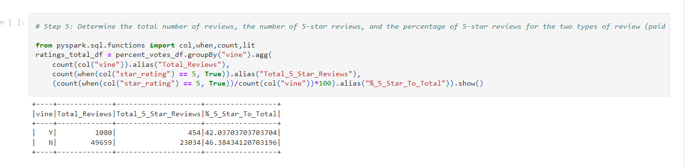

# Amazon_Vine_Analysis
------
------
## Overview:
- **SellBy** wants to know how the reviews of their products compare to the reviews of similar products sold by the competitors.

Type of reviews:
- **Vine** is the review that was written as part of the Vine program (paid).
- **Non-vine** review was not part of the program (unpaid).

## Purpose:
- Analyze the reviews in order to determine if there is any bias toward favorable ones.

## Methodology:
- PySpark to perform the ETL
- AWS RDS
- pgAdmin

## Results:
Analysis of Amazon reviews, **vine (paid)** vs **non-vine (unpaid)** reveals the following:
- Based on the **total customer number** of reviews there are N=18,512 vine and N=3075,148 non-vine reviews.  
- Of the **total vine**, 8,044 are 5-star which make over 43% of the total customer number.
- The **majority** of the total number of reviews **belongs to non-vine reviews.**
- Non-vine reviews make over 46% of the total number.

Tabulated results:

## Summary:
------
TO DO

## Suggestions:
